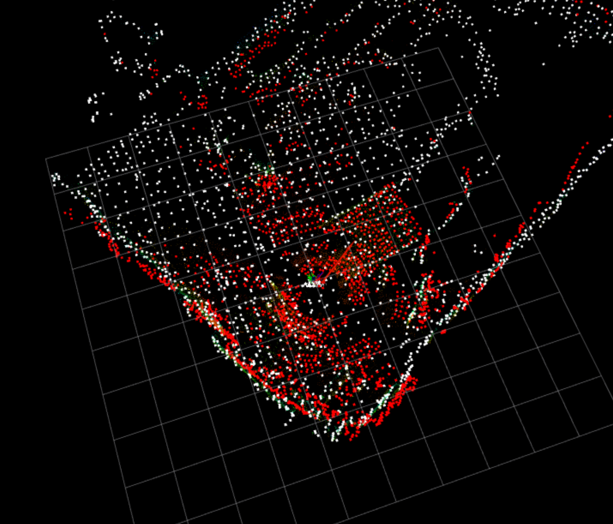

# ICP & SAC-IA relocalization

1. `icp_node.cpp`: simple icp relocalization
2. `san_ia_gicp`: cpp + ros2 implementation of [Point Cloud Registration Method Based on SAC-IA and NDT Fusion](http://www.jgg09.com/EN/abstract/abstract12346.shtml#).

    

